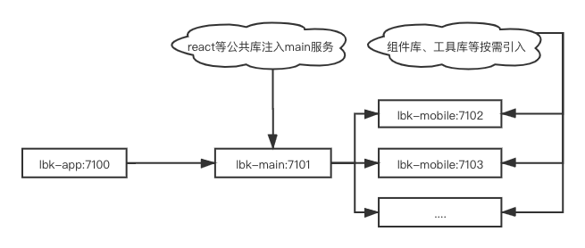

# micro-frontend-app

### 一、快速启动

```shell
// 安装所有应用的依赖
npm run lbk:install
// 启动所有服务
npm run lbk:start
```



### 二、主应用配置说明（lbk-main）

#### 1. loccal.json

```json
{
    //...
    "runtime":{
        "service":[
            {
                "entry": "http://localhost:7102", // 应用访问路径
                "name": "lbk-activity" // 服务名称，在该应用中需添加/lbk-activity路由
            },
            {
                "entry": "http://localhost:7103",
                "name": "lbk-mobile"
            }
        ]
    }
  }
```

#### 2. production.json

```json
{
    // ...
    "runtime":{
        "service":[
            {
                "entry": "/lbk-activity-service/",//nginx配置的路由转发
                "name": "lbk-activity"
            },
            {
                "entry": "/lbk-mobile-service/",
                "name": "lbk-mobile"
            }
        ]
    }
  }
```

### 三、子应用配置说明（lbk-activity）

#### 1.local.json

```json
{
    "env": "local",
    "buildtime": {
      "https": false,
      "cdn_path": "",
      "originServer": {
        "ip": "0.0.0.0",
        "port": "7102"
      },
      "assetsPublicPath":"http://localhost:7102",// 该路径必须跟起的热更新服务端口一致
      "publicPath":"/",
      "debug": false,
      "hot": false,
      "sourceMap": "http://localhost:7102/",
      "uglify": true,
      "analyze": false
    },
    "runtime":{}
  }
```

#### 2.production.json

```json
{
    "env": "production",
    "buildtime": {
      "https": false,
      "cdn_path": "",
      "originServer": {
        "ip": "0.0.0.0",
        "port": "7102"
      },
      "assetsPublicPath":"/lbk-activity-service",// 主应用配置的nginx转发路径一致
      "publicPath":"/lbk-activity-service",// 主应用配置的nginx转发路径一致
      "debug": false,
      "hot": false,
      "sourceMap": "http://localhost:7102/",
      "uglify": true,
      "analyze": false
    },
    "runtime":{}
  }
```

> 注意：没有配置***cdn_path***；***assetsPublicPath、publicPath***须按照上述配置文件说明配置。

### 四、部署方案

#### 1.子运用

```dockerfile
# Dockerfile
FROM nginx:stable-alpine

COPY ./build /usr/share/nginx/html/lbk-activity/
COPY ./default.conf /etc/nginx/conf.d/

EXPOSE 7102
# docker build -t lbk-activity:latest .
```

```nginx
# default.conf
server {
    listen 7102;
    server_name localhost;
  
    location / {
        root   /usr/share/nginx/html;
        port_in_redirect off;
        index  index.html;
        try_files $uri $uri/ /index.html;
    }
}
```

#### 2. 主应用

```dockerfile
# Dockerfile
FROM nginx:stable-alpine

COPY ./build /usr/share/nginx/html/
COPY ./default.conf /etc/nginx/conf.d/

EXPOSE 7101
# docker build -t lbk-main:latest .
```

```nginx
# default.conf
server {
    listen 7101;
    server_name localhost;
  
    location / {
        root   /usr/share/nginx/html;
        port_in_redirect off;
        index  index.html;
        try_files $uri $uri/ /index.html;
    }
}
```

### 3.聚合服务（运维维护）

```dockerfile
# Dockerfile
FROM nginx:stable-alpine

COPY ./default.conf /etc/nginx/conf.d/

EXPOSE 7100
# docker build -t lbk-app:latest .
```

```nginx
# default.conf
server {
    listen 7100;

    server_name localhost;
    
    location / {
        proxy_pass http://192.168.104.163:7101/;
    }
    location /lbk-activity-service/ {
        proxy_pass http://192.168.104.163:7102/lbk-activity/;
    }
    location /lbk-mobile-service/ {
        proxy_pass http://192.168.104.163:7103/lbk-mobile/;
    }
}
```

### 五、可优化的点

#### 1. 公共部分处理（react、react-dom、react-router...）等库的抽取。参考美团提供的方案：

> 基座工程除了路由管理之外，还作为共享层共享全局的基建，例如框架基本库、业务组件等。这样做的目的是，子业务线间如果有相同的依赖，切换的时候就不会出现重复加载的问题。例如下面的代码，我们把React相关库都以全局的方式导出，而子工程加载的时候就会以*external*的形式加载这些库，这样子工程的开发者不需要额外的第三方模块加载器，直接引用即可，和平时开发React应用一致，没有任何学习成本。而和各个业务都相关的公用组件等，我们会放到wmadMicro的全局命名空间下进行管理。主要代码如下：

```js
import * as React from 'react';
import * as ReactDOM from 'react-dom';
import * as ReactRouterDOM from 'react-router-dom';
import * as Axios from 'axios';
import * as History from 'history';
import * as ReactRedux from 'react-redux';
import * as Immutable from 'immutable';
import * as ReduxSagaEffects from 'redux-saga/effects';
import Echarts from 'echarts';
import ReactSlick from 'react-slick';
​
function registerGlobal(root: any, deps: any) {
    Object.keys(deps).forEach((key) => {
        root[key] = deps[key];
    });
}
registerGlobal(window, {
    // 在这里注册暴露给子工程的全局变量
    React,
    ReactDOM,
    ReactRouterDOM,
    Axios,
    History,
    ReactRedux,
    Immutable,
    ReduxSagaEffects,
    Echarts,
    ReactSlick,
});
export default registerGlobal;
```

#### 2. 组件库、hooks库、工具库的子应用通用模块，（需要支持按需加载！）

